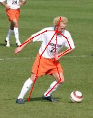
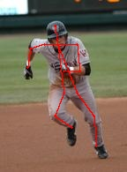
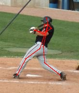
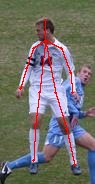

# CPM
This is the personal **PyTorch** implementation of *Convolutional Pose Machines*, CVPR'16.
## Environment
The code is developed using Python 3.6 on Windows 10. NVIDIA GPUs are needed. The code is developed and tested using NVIDIA GeForce GTX 1060.
## Requirement
```
torch == 1.1.0
torchvision == 0.3.0
opencv-python == 3.4
CUDA == 9.0
cuDNN == 7.0
```
## Datasets
[LSPET Dataset](https://sam.johnson.io/research/lspet.html) is used as training dataset and [LSP Dataset](https://sam.johnson.io/research/lsp.html) is used as validation dataset. The number of key points is 14.
## Training CPM
- First download  dataset and modify the path of dataset in **train_cpm/train.py**.
- You can adjust training parameters to fit your own dataset, such as the **k**(the number of key points) of CPM model, the epoch of training process and so on.
- Train CPM model
  ```shell
  python train_cpm/train.py
  ```
## Test
You can download some images to test this CPM model. The size of image is not fixed. After downloading, modify the the path of test image in **test/test_cpm.py**.
To show running results:
```shell
python test/test_cpm.py
```
Then the model estimation result will be shown and saved.
To shown real-time estimation:
```shell
python test/real_time.py
``` 
## Demo
Here are some model estimation results. The test images are from *test_data*.
|||||
|-|-|-|-|
|||||